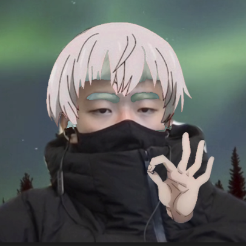

# Chenkuan (Kevin) Lai

chenkuanlai [at] gmail.com / clai [at] ucsb.edu / [GitHub](https://github.com/notkevin12) / [LinkedIn](https://www.linkedin.com/in/notkevin12) / [Resume](Resume.pdf)

I am a Master's Computer Science student at [UC Santa Barbara](cs.ucsb.edu).

---

# Experience

- _Software Engineering Intern_  
  Arista Networks (Jun 2023 - Sep 2023)
- _Quality Assurance Engineer Intern_  
  AppFolio Inc. (Jun 2022 - Aug 2022)
- _Webgame Programmer_  
  UCSB Department of Psychological & Brain Sciences (Jan 2021 - Feb 2021)

# Recognition

- [UCSB CS Distinction in the Major](https://www.cs.ucsb.edu/education/undergraduate/special-programs) advised by Professor Eric Vigoda

# Teaching Assistance

- CS40: Foundations of Computer Science  
  (Spring 2023)
- CS130A: Data Structures and Algorithms I  
  (Fall 2022, Fall 2023)
- CS130B: Data Structures and Algorithms II  
  (Winter 2022, Winter 2023)
- CS138: Formal Languages and Automata  
  (Spring 2024)

# Projects

- _A Survey of MCMC for Ferromagnetic Spin Systems_  
  UCSB CS Distinction in the Major Project (Sep 2022 - Jun 2023)
  - [Poster](DIMAP.pdf)
  - [Source code](https://github.com/ucsb/kevinl-f22-dimap)
- _Smart Eye Mask_  
  (Jan 2023 - Mar 2023)
  - Arduino-based IoT device for measuring and logging biometric data.
  - [Source code](https://github.com/ucsb/CS190B-Eyemask-jeffrey_chen)

---

[Source files for this site](https://github.com/notkevin12/site)
