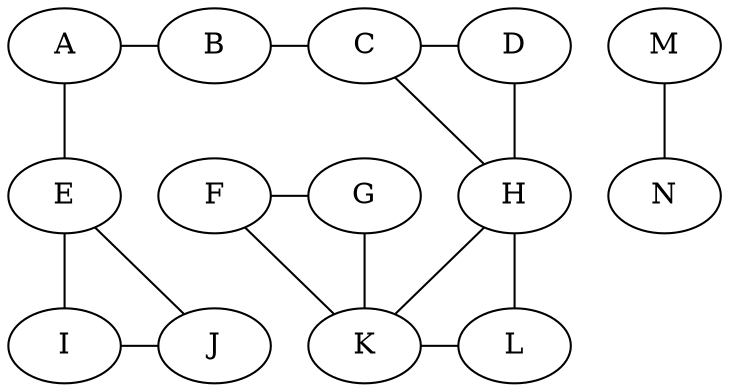
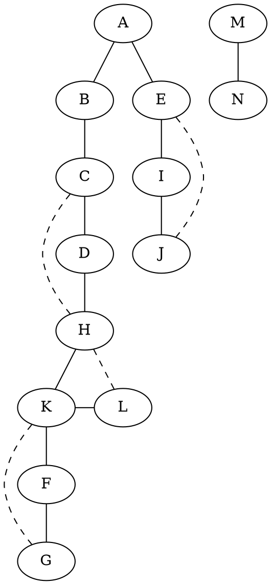
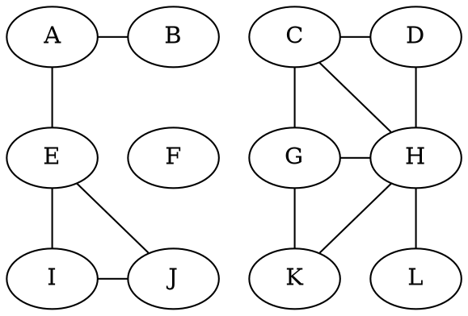
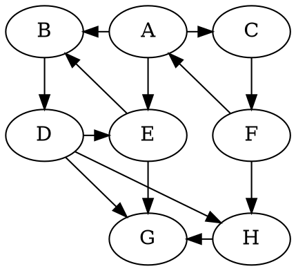
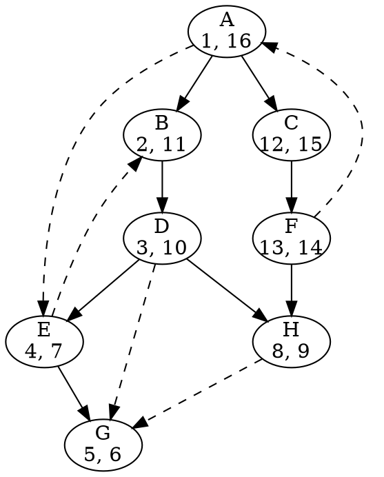
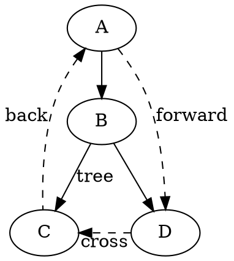

# Depth-first search

Depth-first search is a graph traversal procedure which is useful for finding which vertices are reachable from a vertex in a graph. It is similar to the strategy for exploring a maze: use chalk to mark paths you have already explored, and leave a trail of string behind you so that you can backtrack whenever you reach a dead end. Each junction in the maze is like a vertex in the graph, and each outgoing edge is a possible path to take.

Let's take a look at the following pseudocode to get an idea of how this works:

```
def dfs(G):
    for v in G.vertices:
        visited[v] = false
    for v in G.vertices:
        if visited[v] == false:
            explore(v)

def explore(v):
    visited[v] = true
    for neighbor in edges[v]:
        if visited[neighbor] == false:
            explore(v)
```

In `explore`, the role of the chalk is fulfilled with a boolean array, where every vertex has a `visited` state that is initially false. The call stack plays the role of the string: once every neighbor of the current vertex has been visited, the call returns to an earlier vertex to try other paths.

Consider the following graph.



Assuming that vertices are processed in lexicographic order, the sequence in which the graph is traversed is represented with the following tree. Solid lines mark edges which are travelled across during DFS (called _tree edges_, because of their inclusion in the tree), while dashed lines mark edges which lead to vertices that have already been visited (called _back edges_).



Our depth-first search algorithm takes $O(|V|+|E|)$ time, which linear in the size of the graph.

### Undirected connected components

For undirected graphs, our `dfs` method is already well-equipped to identify _connected components_, or maximal subgraphs in which every vertex has a path to every other vertex. Consider the following graph:



This graph has 3 connected components: $\{A, B, E, I , J\}$, $\{F\}$, and $\{C, D, G, H, K, L\}$. It turns out that `explore(v)` explores every vertex in the same connected component as $v$. Why? If a vertex $u$ is explored from a call of `explore(v)`, then there exists a path from $v$ and $u$. Since the graph is undirected, a path from $v$ to $u$ is the same as a path from $u$ to $v$. As such, a slight modification to our `dfs` algorithm allows us to identify which vertices are in the same connected component for an undirected graph.

```
def dfs(G):
    ccnum = 0
    for v in G.vertices:
        visited[v] = false
    for v in G.vertices:
        if visited[v] == false:
            explore(v, ccnum)
            ccnum += 1

def explore(v, ccnum):
    visited[v] = true
    cc[v] = ccnum
    for neighbor in edges[v]:
        if visited[neighbor] == false:
            explore(v, ccnum)
```

The only difference between this code and the one from above is the addition of a global `ccnum` counter which is incremented once for every call of `explore`. All nodes which are visited from this call are part of the same connected component, so they are assigned the same value of `ccnum` to identify which component they are in. With this change, our modified `dfs` includes an assignment of vertices to numbered connected components in its output.

### Directed acyclic graphs and topological sort

Our `dfs` method can be easily applied to directed graphs by respecting the direction of edges during `explore`. But what about connectivity in undirected graphs? Before we address that question, we need to modify our algorithm to record more state during traversal.

```
def dfs(G):
    timer = 0
    for v in G.vertices:
        visited[v] = false
    for v in G.vertices:
        if visited[v] == false:
            explore(v, timer)

def explore(v, timer):
    visited[v] = true
    previsit(v, timer)
    for neighbor in edges[v]:
        if visited[neighbor] == false:
            explore(v)
    postvisit(v, timer)

def previsit(v, timer):
    pre[v] = timer
    timer += 1

def postvisit(v, timer):
    post[v] = timer
    timer += 1
```

A global counter `timer` is initialized to 0 at the beginning of `dfs` and incremented throughout the various `explore` calls. We add two new methods, `previsit` and `postvisit`. The idea is that `previsit` records the time when we first visit a vertex and `postvisit` records when we finish processing all the neighbors of the current vertex. All `previsit` and `postvisit` do is record the current value of `timer`, then increment it by 1.

Consider the following graph:



After running `dfs` on this directed graph (again, considering vertices in lexicographic order), we produce the following traversal tree. Each vertex is labeled with `(pre, post)` pairs.



Having established the means to collect previsit and postvisit times, we can now describe the 4 types of edges that are encountered during the depth-first traversal of a directed graph:

- Tree edges are included in the DFS tree.
- Back edges lead from a vertex to an ancestor of that vertex in the same tree.
- Forward edges lead from a vertex to nonchild descendant of that vertex in the same tree.
- Cross edges lead from a vertex to another vertex that is neither its ancestor nor its descendant in the same tree.


