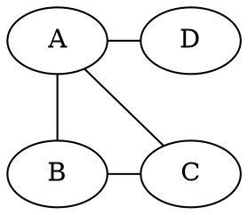
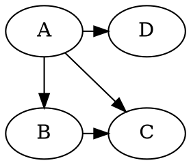

# Graphs

Notes based on Section 3.1 of [Algorithms][1] by Dasgupta, Papadimitriou, and Vazirani.

### Definition

A graph is defined as $G=(V,E)$, where $V$ is a set of vertices and $E$ is a set of edges connecting vertices together.

Let $V = \{A, B, C, D\}$ and let $E = \{(A, B), (A, C), (A, D), (B, C)\}$. The graph formed from these sets resembles the diagram below.



In this case, we assume that there is no difference between denoting an edge between vertices $u$ and $v$ as $(u, v)$ versus $(v, u)$. With this characteristic, the graph is said to have _undirected_ edges.

This leads to the notion of _directed_ edges, where an edge from $u$ to $v$ and an edge going from $v$ to $u$ are considered distinct edges. To denote an edge going from $u$ to $v$, we use the notation $(u, v)$. Remember that $(u, v)$ is different from $(v, u)$ for a directed graph.

Recall the previous graph: let $V = \{A, B, C, D\}$ and let $E = \{(A, B), (A, C), (A, D), (B, C)\}$. This time, however, we'll assert that the edges are directed. Using arrows to show the directions of edges, the diagram resembles the following:



### Adjacency matrix representation

A graph with $n=|V|$ nodes can be represented with an $n\times n$ adjacency matrix $a$, where the $(i,j)$th entry is defined as:

$$
a_{i,j} =
\begin{cases}
1 & \text{if there is an edge from $v_i$ to $v_j$}\\
0 & \text{otherwise}
\end{cases}
$$

By convention, $v_i$ is arranged along the vertical side of the matrix, and $v_j$ is arranged along the horizontal side. For our directed graph from above, the adjacency matrix would look like the following:

$$
\def\arraystretch{1.5}
\begin{array}{c|c|c|c|c}
  & A & B & C & D \\\hline
A & 0 & 1 & 1 & 1 \\\hline
B & 0 & 0 & 1 & 0 \\\hline
C & 0 & 0 & 0 & 0 \\\hline
D & 0 & 0 & 0 & 0
\end{array}
$$

For an undirected edge $(u, v)$, its equivalent is two directed edges $(u, v)$ and $(v, u)$. As a result, adjacency lists for undirected graphs are [symmetric][2]. Applying our example from above again, this time with undirected edges:

$$
\def\arraystretch{1.5}
\begin{array}{c|c|c|c|c}
  & A & B & C & D \\\hline
A & 0 & 1 & 1 & 1 \\\hline
B & 1 & 0 & 1 & 0 \\\hline
C & 1 & 1 & 0 & 0 \\\hline
D & 1 & 0 & 0 & 0
\end{array}
$$

The primary advantage of the adjacency matrix lies in the ability to check for edge existence in $O(1)$ time. However, note how an adjacency matrix for a graph with $n$ vertices occupies $O(n^2)$ space, regardless of whether all $\binom{n}{2}$ possible edges exist in the graph. An alternative representation, the adjacency list, trades off constant time edge-checks in favor of memory efficiency.

### Adjacency list representation

For a a graph with $n=|V|$ nodes, its adjacency list representation consists of $n$ linked-lists, each associated with a vertex. The linked-list for a vertex $u$ contains all the vertices which $u$ has outgoing edges to, or $\forall v \in V \mid (u, v) \in E$.

Here's our familiar example in adjacency list form, with both directed and undirected variants.

```
(directed)              (undirected)
A -> B, C, D            A -> B, C, D
B -> C                  B -> A, C
C ->                    C -> A, B
D ->                    D -> A
```

Checking for the existence of an edge $(u,v)$ becomes a matter of searching for $v$ in $u$'s adjacency list, which is an $O(|V|)$ time operation. However, by giving up constant-time edge lookup, the adjacency list only occupies $O(|E|)$ space. Note that, for a graph with $n$ vertices and $m$ edges, $m\leq n^2$, since a graph with no self-loops has at most $\binom{n}{2}$ edges. This means that, at worst, an adjacency list will occupy as much space as an adjacency matrix, while at best, an adjacency list will save a considerable amount of memory. Just look at how many more $0$s there are than $1$s in our directed adjacency matrix example!

[1]: https://www.amazon.com/Algorithms-Sanjoy-Dasgupta/dp/0073523402
[2]: https://en.wikipedia.org/wiki/Symmetric_matrix
