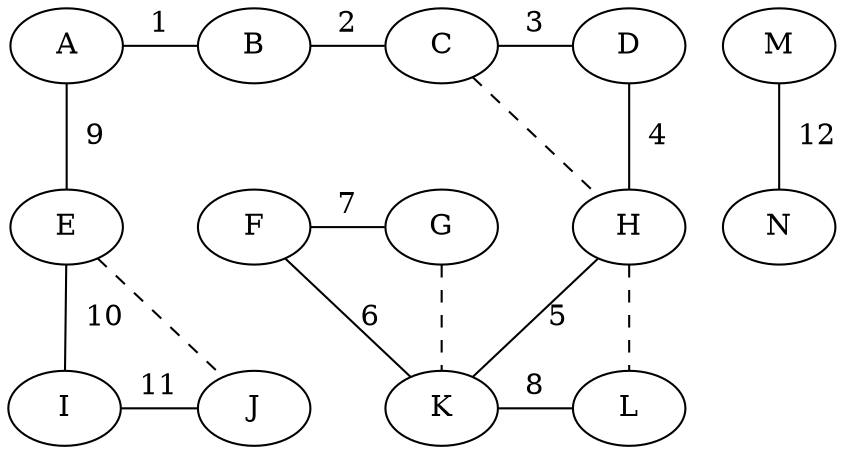

# I hate it sometimes

```
graph graphname {
    { rank=same; A; B; C; D; M; }
    { rank=same; E; F; G; H; N; }
    { rank=same; I; J; K; L; }
    A -- B [ label=1 ];
    A -- E [ label="  9" ];
    B -- C [ label=2 ];
    C -- D [ label=3 ];
    C -- G [ style=invis ];
    C -- H [ style=dashed ];
    D -- H [ label="  4" ];
    E -- I [ label="  10" ];
    E -- J [ style=dashed ];
    F -- G [ label=7 ];
    F -- J [ style=invis ];
    F -- K [ label=6 ];
    G -- K [ style=dashed ];
    G -- H [ style=invis ];
    H -- K [ label=5 ];
    H -- L [ style=dashed ];
    I -- J [ label=11 ];
    K -- L [ label=8 ];
    M -- N [ label="  12" ];
}
```


